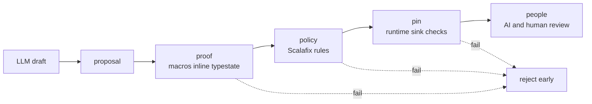

# ProofGate

Nice try, LLM. Now prove it.

ProofGate is a Scala-native review conveyor for LLM-written data-pipeline code.
The core idea is simple:

1. proposal
2. proof
3. policy
4. pin
5. people

The first reviewer should be machine-enforced structure, not a human and not another LLM.
After those gates pass, review is AI and human, not AI or human.

## Review flow



## Current stack

This repository currently targets the stable stack:

- JDK `21`
- Scala `3.8.3`
- sbt `1.12.11`
- Scalafmt `3.11.1`
- Scalafix / sbt-scalafix `0.14.6`
- MUnit `1.3.0`

## Design notes

- [ADR 0001: review conveyor](docs/adr/0001-review-conveyor.md)

## Module layout

- `modules/model`: core ADTs, typed errors, report model
- `modules/proof`: proposal DSL, typestate builder, `SchemaConforms` proof (Exact, Backward, Forward)
- `modules/runtime-spark`: runtime shape derivation, sink-boundary pin checks, Spark schema adapter
- `modules/cli`: CLI entry point
- `modules/examples`: tiny usage examples
- `modules/fixtures-compile-fail`: reference snippets for compile-fail demos
- `modules/fixtures-policy-fail`: deliberate violations that Scalafix must reject;
  not aggregated by the root project, run on demand via `scripts/check-policy-fixtures.sh`

## Commands

```bash
sbt test
sbt reviewGates
sbt reviewPolicy
sbt reviewConveyor
scripts/check-policy-fixtures.sh
sbt "cli / runMain proofgate.cli.Main review --revision abc123 --out target/proof-gate-review.md"
sbt "cli / runMain proofgate.cli.Main review --revision abc123 --out target/proof-gate-review.json"
```

The GitHub Actions workflow runs the same conveyor and publishes the generated Markdown report to the job summary.

Example rejecting review packet:

```bash
sbt "cli / runMain proofgate.cli.Main review --revision abc123 --finding proof|blocker|proof.schema-exact|Missing_customer_id|pipelines/orders.scala|Add_the_field"
```

## Policy fixtures

`reviewPolicy` uses Scalafix `DisableSyntax` rules to reject selected forbidden patterns in core code.
The expected-failure fixtures prove that these patterns are blocked:

- direct `sys.env`
- direct `System.getenv`
- direct `ConfigFactory`
- raw `try` / `catch`
- raw `throw`

## Schema policies

`SchemaConforms[Out, Contract, Policy]` is the compile-time evidence the proof layer requires.

- `SchemaPolicy.Exact`: `Out` and `Contract` must have the same field names, types, and nesting.
- `SchemaPolicy.Backward`: `Out` may add fields beyond `Contract`. Required `Contract`
  fields must still exist in `Out` with the declared type. Missing optional `Contract`
  fields are accepted. Old consumers reading `Contract` keep working when the producer
  adds fields.
- `SchemaPolicy.Forward`: `Out` may drop fields that `Contract` declares. Extra fields
  in `Out` and type drift still fail. Old producers stay compatible with new consumers
  that have widened the contract.

## Spark bridge

`SparkSchemaAdapter` converts a Spark `DataType.simpleString` field description into a
`RuntimeShape` without forcing this repository to depend on Spark binaries. Callers obtain
field info from their own Spark session, for example:

```scala
val info = structType.fields.map(f =>
  SparkFieldInfo(f.name, f.dataType.simpleString, f.nullable)
).toVector

val shape = SparkSchemaAdapter.fromSparkFields(info)
```

The adapter understands Spark primitive types, `array<T>`, `map<K,V>`, and nested `struct<...>`
expressions. The runtime pin diff treats unknown Spark types as raw names so the reviewer can
either fix the type or extend the adapter.

This is a lightweight bridge, not a full Spark-dependent `StructType` adapter. It preserves
top-level `StructField.nullable`, but nested fields parsed from `simpleString` are marked nullable
because Spark does not encode nested nullability in that string form. Use the compile-derived
contract shape as the expected side when nested nullability must be exact, or add the optional
Spark example module described in the docs.

See [docs/spark-bridge.md](docs/spark-bridge.md) for an end-to-end recipe, including the
`Dataset[A] => RuntimeShape` helper and a sink-time validate call.

## Status

This is an early POC scaffold.
The current code proves the build, module wiring, typed-error model, typestate assembly,
exact, backward, and forward structural contract proofs, an in-memory runtime shape pin,
a Spark schema bridge, and a CI-friendly Markdown and JSON review report path.
