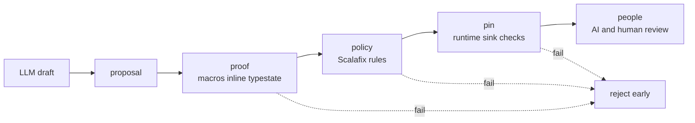

# proof-gate

Nice try, LLM. Now prove it.

proof-gate is a Scala-native review conveyor for LLM-written data-pipeline code.
The core idea is simple:

1. proposal
2. proof
3. policy
4. pin
5. people

The first reviewer should be machine-enforced structure, not a human and not another LLM.

## Review flow



## Current stack

This repository currently targets the stable stack:

- JDK `21`
- Scala `3.8.3`
- sbt `1.12.11`
- Scalafmt `3.11.1`
- Scalafix / sbt-scalafix `0.14.6`
- MUnit `1.3.0`

## Module layout

- `modules/model`: core ADTs, typed errors, report model
- `modules/proof`: proposal DSL, typestate builder, proof placeholders
- `modules/runtime-spark`: runtime pin abstractions and Spark-facing boundary
- `modules/cli`: CLI entry point
- `modules/examples`: tiny usage examples
- `modules/fixtures-compile-fail`: reserved for compile-fail fixtures

## Commands

```bash
sbt test
sbt reviewGates
sbt reviewPolicy
sbt reviewConveyor
```

## Status

This is an early POC scaffold.
The current code proves the build, module wiring, typed-error model, and the first proposal/proof skeleton.
